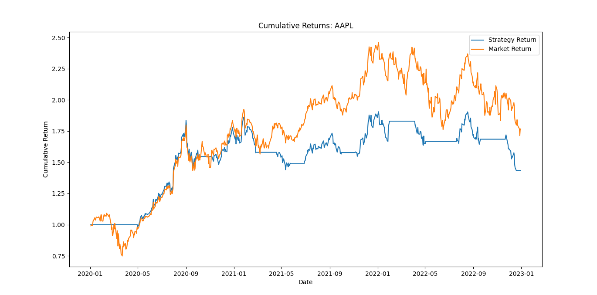

# Trading Strategy Backtesting Project

Ce projet implémente une stratégie de trading basée sur des moyennes mobiles et permet de backtester cette stratégie sur des données historiques d'actions. Il vise à fournir une démonstration pratique de l'utilisation de stratégies quantitatives en finance de marché.

## Fonctionnalités

- **Téléchargement automatique des données financières** via Yahoo Finance.
- **Calcul des moyennes mobiles** :
  - SMA (Simple Moving Average) sur 20 jours.
  - SMA sur 50 jours.
- **Génération de signaux d'achat et de vente** basés sur le croisement des moyennes mobiles.
- **Calcul des performances** :
  - Retours stratégiques.
  - Retours du marché.
  - Sharpe Ratio.
  - Sortino Ratio.
  - Max Drawdown.
  - Retours annualisés.
  - Volatilité annualisée.
- **Affichage optionnel des graphiques** via une fenêtre pop-up.
- **Export des résultats** sous forme de fichiers CSV et texte.

## Installation

### Cloner le dépôt GitHub :
```bash
git clone https://github.com/Andromede75/trading-strategy-backtest.git
cd trading-strategy-backtest
```

### Créer un environnement virtuel (recommandé) :
```bash
python -m venv env
source env/bin/activate  # Sur Linux/Mac
env\Scripts\activate  # Sur Windows
```

### Installer les dépendances :
```bash
pip install -r requirements.txt
```

## Utilisation

Exécuter le script principal :
```bash
python trading_strategy_backtest.py
```
Lors de l'exécution, une fenêtre pop-up demandera si vous souhaitez afficher les graphiques. Les résultats seront également sauvegardés dans des fichiers CSV et texte contenant les principales métriques de performance.

## Résultats

Les résultats générés incluent :
- Un fichier CSV contenant les données de la stratégie et les signaux générés.
- Un fichier texte résumant les principales métriques de performance :
  - Sharpe Ratio.
  - Sortino Ratio.
  - Max Drawdown.
  - Retours annualisés.
  - Volatilité annualisée.

## Exemples de résultats

### Résultats affichés dans la console

```
Sharpe Ratio: 1.25
Sortino Ratio: 1.80
Max Drawdown (Strategy): -15.75%
Max Drawdown (Market): -22.40%
Annualized Return: 12.50%
Annualized Volatility: 18.30%
```

### Graphiques générés

#### 1. Prix et moyennes mobiles de l'action AAPL


#### 2. Retours cumulés : Stratégie vs Marché


#### 3. Drawdown au fil du temps


## Explications techniques

La stratégie utilise les **moyennes mobiles simples** (SMA) pour générer des signaux :
- **Signal d'achat** : Lorsque la SMA 20 jours croise au-dessus de la SMA 50 jours.
- **Signal de vente** : Lorsque la SMA 20 jours croise en dessous de la SMA 50 jours.

Les métriques de performance sont calculées comme suit :
- **Sharpe Ratio** : Mesure le rendement ajusté au risque en comparant les retours de la stratégie avec le taux sans risque.
- **Sortino Ratio** : Similaire au Sharpe Ratio, mais ne prend en compte que la volatilité négative.
- **Max Drawdown** : Mesure la perte maximale par rapport à un sommet historique du portefeuille.

## Améliorations possibles

- Ajouter d'autres indicateurs techniques (ex : RSI, MACD).
- Tester la stratégie sur différents actifs financiers.
- Créer une interface utilisateur interactive avec **Streamlit**.

## Auteurs

- **Mathieu Derville** – [GitHub](https://github.com/Andromede75)

## Licence

Ce projet est sous licence MIT - voir le fichier [LICENSE](LICENSE) pour plus de détails.

## Références

- [Yahoo Finance API](https://pypi.org/project/yfinance/)
- [Documentation officielle de Matplotlib](https://matplotlib.org/stable/contents.html)
- [Backtrader - Python Backtesting Library](https://www.backtrader.com/)

